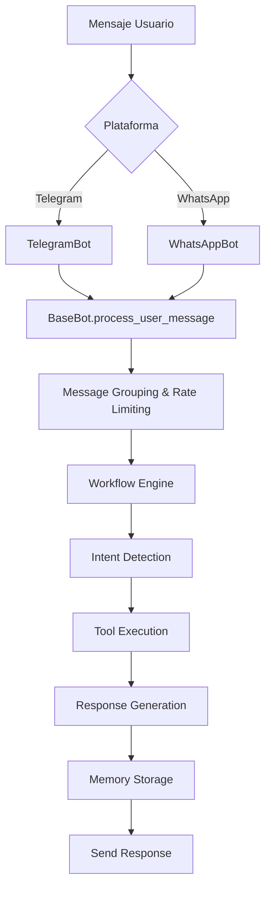

# 🍕 One Pizzeria Multi-Platform AI Assistant

Un asistente virtual inteligente para One Pizzeria que ayuda a los clientes con pedidos, consultas sobre el menú, entregas y más. Disponible en **Telegram** y **WhatsApp**.

## 🚀 Plataformas Soportadas

- 📱 **Telegram Bot** - Con comandos interactivos y interfaz rica
- 💬 **WhatsApp Business API** - Integración nativa con WhatsApp Business
- 🔄 **Multi-plataforma** - Ejecuta ambos bots simultáneamente

## ✨ Características

### Funcionalidades Principales
- 🤖 **IA Conversacional** - Respuestas inteligentes usando LLM (Google Gemini/Groq)
- 🍕 **Gestión de Pedidos** - Proceso completo de pedidos con validación
- 📋 **Menú Interactivo** - Consulta de productos, precios y disponibilidad
- 📍 **Cálculo de Entregas** - Verificación de zonas y cálculo de costos
- 💾 **Memoria Persistente** - Historial de conversaciones y contexto del cliente
- 🛡️ **Rate Limiting** - Protección contra spam y uso abusivo

### Características Técnicas
- ⚡ **Arquitectura Async** - Manejo concurrente de múltiples usuarios
- 🔄 **Workflow Engine** - Procesamiento inteligente de mensajes
- 🗄️ **Base de Datos** - Supabase para persistencia
- 📊 **Monitoreo** - Logs detallados y métricas de rendimiento
- 🧩 **Modular** - Arquitectura extensible y mantenible

## 🛠️ Instalación y Configuración

### Requisitos Previos

- Python 3.8 o superior
- Cuenta en [Meta for Developers](https://developers.facebook.com/) (para WhatsApp)
- Bot de Telegram (opcional, obtener de [@BotFather](https://t.me/BotFather))
- Base de datos Supabase
- Cuenta en Groq o Google AI

### 1. Clonar el Repositorio

```bash
git clone https://github.com/tu-usuario/newOnePizzeria.git
cd newOnePizzeria
```

### 2. Instalar Dependencias

```bash
# Crear entorno virtual
python -m venv venv

# Activar entorno virtual
# Windows:
venv\Scripts\activate
# macOS/Linux:
source venv/bin/activate

# Instalar dependencias
pip install -r requirements.txt
```

### 3. Configuración de Variables de Entorno

Crea un archivo `.env` en la raíz del proyecto:

```bash
# Base de Datos
SUPABASE_URL=tu_supabase_url
SUPABASE_KEY=tu_supabase_key

# IA y LLMs
GROQ_API_KEY=tu_groq_api_key
GOOGLE_API_KEY=tu_google_api_key
OPENAI_API_KEY=tu_openai_api_key

# Modelos (opcional)
GROQ_MODEL=meta-llama/llama-4-scout-17b-16e-instruct
GOOGLE_MODEL=gemini-2.5-flash
OPENAI_MODEL=gpt-4o-mini-2024-07-18

# Telegram Bot (opcional)
TELEGRAM_BOT_TOKEN=tu_telegram_bot_token

# WhatsApp Business API (opcional)
WHATSAPP_ACCESS_TOKEN=tu_whatsapp_access_token
WHATSAPP_PHONE_NUMBER_ID=tu_phone_number_id
WHATSAPP_WEBHOOK_VERIFY_TOKEN=tu_webhook_verify_token
WHATSAPP_API_URL=https://graph.facebook.com/v18.0

# Servicios de Ubicación
LOCATIONIQ_TOKEN=tu_locationiq_token
```

### 4. Configuración Específica por Plataforma

#### 📱 Para Telegram
1. Contacta [@BotFather](https://t.me/BotFather) en Telegram
2. Usa `/newbot` para crear un bot
3. Copia el token y agrégalo a `TELEGRAM_BOT_TOKEN`

#### 💬 Para WhatsApp
Sigue la guía detallada: **[WHATSAPP_SETUP.md](WHATSAPP_SETUP.md)**

Resumen rápido:
1. Crear app en [Meta for Developers](https://developers.facebook.com/)
2. Configurar WhatsApp Business API
3. Obtener credenciales (Access Token, Phone Number ID, etc.)
4. Configurar webhook para recibir mensajes

## 🚀 Uso

### Verificar Configuración

```bash
# Verificar qué plataformas están configuradas
python main.py --config
```

### Ejecutar el Bot

#### Solo Telegram
```bash
python main.py --platform telegram
```

#### Solo WhatsApp
```bash
python main.py --platform whatsapp --port 5000
```

#### Ambas Plataformas
```bash
python main.py --platform both
```

#### Autodetección
```bash
# Detecta automáticamente las plataformas configuradas
python main.py
```

### Opciones Adicionales

```bash
# WhatsApp con configuración específica
python main.py --platform whatsapp --host 0.0.0.0 --port 8000 --debug

# Ver ayuda completa
python main.py --help
```

## 🏗️ Arquitectura

### Estructura del Proyecto

```
newOnePizzeria/
├── src/
│   ├── base_bot.py         # Clase base para todos los bots
│   ├── telegram_bot.py     # Implementación de Telegram
│   ├── whatsapp_bot.py     # Implementación de WhatsApp
│   ├── workflow.py         # Motor de workflow de IA
│   ├── memory.py           # Gestión de memoria y persistencia
│   ├── state.py            # Gestión de estado de conversaciones
│   ├── tools.py            # Herramientas y funciones del bot
│   ├── prompts.py          # Templates de prompts para IA
│   └── handles.py          # Manejadores de eventos
├── tests/                  # Tests automatizados
├── config.py              # Configuración central
├── main.py                # Punto de entrada principal
├── WHATSAPP_SETUP.md      # Guía de configuración WhatsApp
└── README.md              # Esta documentación
```

### Flujo de Procesamiento



### Características de la Arquitectura

- **Modular**: Cada plataforma hereda de `BaseBot` para compartir funcionalidad
- **Asíncrona**: Manejo concurrente de múltiples conversaciones
- **Extensible**: Fácil agregar nuevas plataformas (Discord, Slack, etc.)
- **Resiliente**: Manejo de errores y reintentos automáticos
- **Observable**: Logs detallados para debugging y monitoreo

## 🔧 Desarrollo

### Agregar Nueva Plataforma

1. Crear nueva clase que herede de `BaseBot`
2. Implementar métodos abstractos requeridos
3. Agregar configuración en `config.py`
4. Actualizar `main.py` para incluir la nueva plataforma

### Ejemplo: Bot de Discord

```python
from src.base_bot import BaseBot

class DiscordBot(BaseBot):
    def __init__(self, token: str):
        super().__init__()
        self.token = token
        # Inicialización específica de Discord
    
    async def send_message(self, recipient: str, message: str, **kwargs) -> bool:
        # Implementación específica de Discord
        pass
    
    # ... otros métodos requeridos
```

### Testing

```bash
# Ejecutar todos los tests
python -m pytest tests/

# Test específico
python -m pytest tests/test_whatsapp_bot.py -v

# Test con cobertura
python -m pytest --cov=src tests/
```

## 📊 Monitoreo y Logs

### Niveles de Log

- `INFO`: Operaciones normales, mensajes recibidos/enviados
- `WARNING`: Rate limiting, reintentos
- `ERROR`: Errores de API, fallos de envío
- `DEBUG`: Información detallada para desarrollo

### Métricas Importantes

- Mensajes procesados por minuto
- Tasa de éxito de entrega
- Tiempo de respuesta promedio
- Usuarios activos por plataforma

### Endpoints de Monitoreo

```bash
# Estado de Telegram
curl http://localhost:8000/telegram/status

# Estado de WhatsApp  
curl http://localhost:5000/whatsapp/status

# Métricas generales
python -c "from src.telegram_bot import TelegramBot; bot = TelegramBot('token'); print(bot.get_pending_messages_info())"
```

## 🔒 Seguridad y Rate Limiting

### Rate Limiting Implementado

- **Telegram**: 30 mensajes/segundo por bot
- **WhatsApp**: 1 mensaje/6 segundos por usuario, 80 msg/sec global
- **Por Usuario**: Protección contra spam individual
- **Global**: Protección del sistema completo

### Seguridad

- ✅ Validación de webhooks
- ✅ Tokens seguros en variables de entorno
- ✅ Rate limiting automático
- ✅ Sanitización de inputs
- ✅ Logs sin información sensible

## 🚀 Despliegue en Producción

### Docker (Recomendado)

```dockerfile
FROM python:3.9-slim

WORKDIR /app
COPY requirements.txt .
RUN pip install -r requirements.txt

COPY . .

EXPOSE 5000
CMD ["python", "main.py", "--platform", "both", "--host", "0.0.0.0"]
```

### Variables de Entorno de Producción

```bash
# Configuración de producción
ENVIRONMENT=production
LOG_LEVEL=INFO

# URLs públicas
WHATSAPP_WEBHOOK_URL=https://tu-dominio.com/webhook/whatsapp

# Configuración de servidor
HOST=0.0.0.0
PORT=5000
```

### Consideraciones de Producción

1. **HTTPS Obligatorio**: WhatsApp requiere HTTPS para webhooks
2. **Load Balancing**: Para múltiples instancias
3. **Base de Datos**: Configurar pool de conexiones
4. **Monitoreo**: Implementar alertas y métricas
5. **Backup**: Estrategia de respaldo de datos

## 🤝 Contribución

1. Fork el repositorio
2. Crea una rama para tu feature (`git checkout -b feature/AmazingFeature`)
3. Commit tus cambios (`git commit -m 'Add some AmazingFeature'`)
4. Push a la rama (`git push origin feature/AmazingFeature`)
5. Abre un Pull Request

### Estándares de Código

- **Python**: PEP 8
- **Type Hints**: Obligatorios para funciones públicas
- **Docstrings**: Formato Google Style
- **Tests**: Coverage mínimo 80%

## 📝 Licencia

Este proyecto está licenciado bajo la Licencia MIT - ver el archivo [LICENSE](LICENSE) para detalles.

## 🆘 Soporte

### Documentación Adicional

- [Configuración WhatsApp](WHATSAPP_SETUP.md) - Guía completa para WhatsApp
- [Guía de Base de Datos](DATABASE_SCHEMA.md) - Estructura de datos
- [Guía de Pedidos](ORDER_GUIDE.md) - Flujo de pedidos

### Resolución de Problemas

#### Problemas Comunes

1. **"Webhook verification failed"**
   - Verificar `WHATSAPP_WEBHOOK_VERIFY_TOKEN`
   - Confirmar URL del webhook es accesible

2. **"Rate limit exceeded"**
   - Normal en WhatsApp, el bot maneja automáticamente
   - Revisar logs para patrones de uso

3. **"Bot no responde"**
   - Verificar configuración con `python main.py --config`
   - Revisar logs para errores

### Contacto

- **Desarrollo**: Contactar al equipo de desarrollo
- **Issues**: Usar GitHub Issues
- **Discusiones**: GitHub Discussions

---

## 🎉 ¡Comenzar Ahora!

1. **Configura tu primer bot**:
   ```bash
   python main.py --config
   ```

2. **Para desarrollo rápido (solo Telegram)**:
   ```bash
   # Más simple de configurar para pruebas
   python main.py --platform telegram
   ```

3. **Para producción completa**:
   ```bash
   # Sigue la guía de WhatsApp y ejecuta ambos
   python main.py --platform both
   ```

¡Tu asistente de pizzería multi-plataforma estará listo en minutos! 🍕🤖
