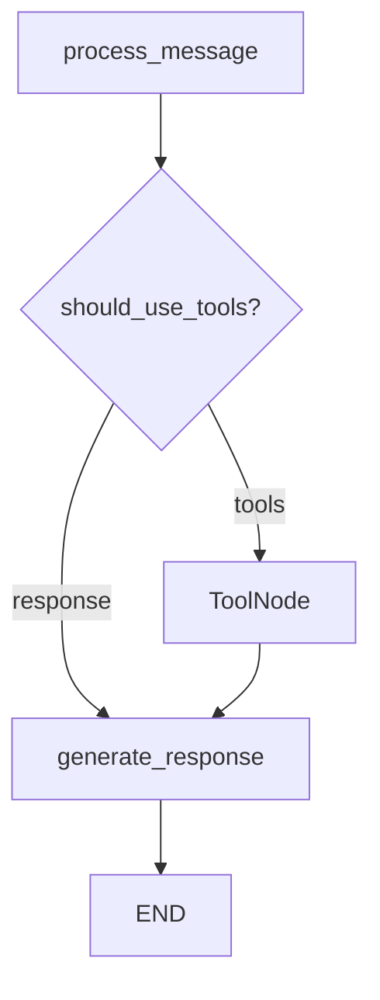

# 🍕 OnePizzeria Chatbot - MVP Completado

## ✅ Lo que hemos logrado

### **1. Arquitectura Funcional**
- ✅ **Workflow LangGraph simplificado** - Flujo de conversación con 3 nodos principales
- ✅ **Sistema de memoria híbrido** - Cache en memoria + persistencia en Supabase
- ✅ **Herramientas de base de datos** - 8 herramientas críticas como `@tool` decorators
- ✅ **Modelos de datos** - `ChatState`, `ProductDetails`, `Order` bien definidos
- ✅ **Sistema de prompts** - Prompts especializados para diferentes contextos

### **2. Integración de Telegram**
- ✅ **Bot de Telegram funcional** - Handlers para comandos y mensajes
- ✅ **Comandos básicos** - `/start`, `/help`, `/menu`, `/pedido`
- ✅ **Manejo de errores** - Error handling robusto para fallos
- ✅ **Logging estructurado** - Seguimiento de conversaciones y errores

### **3. Herramientas de Base de Datos**
- ✅ **Gestión de clientes** - `get_customer`, `create_customer`, `update_customer`
- ✅ **Consultas de menú** - `search_menu`, `get_full_menu`
- ✅ **Gestión de pedidos** - `get_active_order`, `create_or_update_order`, `finalize_order`

### **4. Sistema de Testing**
- ✅ **Pruebas básicas** - Verificación de modelos, prompts y componentes
- ✅ **Demo funcional** - Simulación completa de conversaciones
- ✅ **Mocks integrados** - Para desarrollo sin dependencias externas

## 🏗️ Estructura del Proyecto

```
newOnePizzeria/
├── src/
│   ├── __init__.py
│   ├── models.py              # 📊 Modelos de datos (ChatState, Order, etc.)
│   ├── prompts.py             # 💬 Sistema de prompts
│   ├── tools.py               # 🔧 8 herramientas críticas de BD
│   ├── workflow.py            # 🔄 Workflow LangGraph simplificado
│   ├── memory.py              # 🧠 Sistema de memoria híbrido
│   ├── checkpointer.py        # 💾 Gestión de estado
│   └── telegram_bot.py        # 🤖 Integración Telegram
├── tests/
│   ├── test_basic.py          # ✅ Pruebas básicas
│   ├── test_workflow.py       # ✅ Pruebas de workflow
│   ├── test_tools.py          # ✅ Pruebas de herramientas
│   └── test_integration.py    # ✅ Pruebas de integración
├── main.py                    # 🚀 Punto de entrada
├── demo_simple.py             # 🎯 Demo sin dependencias
├── pyproject.toml             # 📦 Configuración del proyecto
└── README.md
```

## 🔧 Flujo del Workflow (LangGraph)



### **Nodos del Workflow:**
1. **`process_message`** - Procesa mensaje del usuario con LLM + herramientas
2. **`tools`** - Ejecuta herramientas de base de datos si son necesarias
3. **`generate_response`** - Genera respuesta final para el usuario

## 🛠️ Herramientas Implementadas

| Herramienta | Función | Estado |
|-------------|---------|--------|
| `get_customer` | Buscar cliente por ID | ✅ |
| `create_customer` | Crear nuevo cliente | ✅ |
| `update_customer` | Actualizar datos cliente | ✅ |
| `search_menu` | Buscar productos específicos | ✅ |
| `get_full_menu` | Obtener menú completo | ✅ |
| `get_active_order` | Obtener pedido activo | ✅ |
| `create_or_update_order` | Crear/actualizar pedido | ✅ |
| `finalize_order` | Finalizar pedido | ✅ |

## 📋 Funcionalidades del Bot

### **Comandos de Telegram:**
- `/start` - Saludo inicial y bienvenida
- `/help` - Ayuda y comandos disponibles
- `/menu` - Mostrar menú completo
- `/pedido` - Estado del pedido actual

### **Flujo de Conversación:**
1. **Saludo y registro** - Identificar/registrar cliente
2. **Consulta de menú** - Mostrar productos disponibles
3. **Toma de pedidos** - Agregar productos al carrito
4. **Confirmación** - Validar pedido y datos de entrega
5. **Finalización** - Procesar pedido

## 🧪 Testing y Demo

### **Ejecutar Pruebas:**
```bash
uv run python -m pytest tests/test_basic.py -v
```

### **Ejecutar Demo:**
```bash
uv run python demo_simple.py
```

## 🚀 Próximos Pasos para Producción

### **1. Configuración de Entorno (.env)**
```bash
# Requerido para producción
SUPABASE_URL=https://tu-proyecto.supabase.co
SUPABASE_KEY=tu_supabase_key
OPENAI_API_KEY=tu_openai_key
TELEGRAM_BOT_TOKEN=tu_bot_token
```

### **2. Configuración de Base de Datos**
- Crear tablas en Supabase según `DATABASE_SCHEMA.md`
- Poblar tablas con datos del menú
- Configurar políticas de seguridad

### **3. Despliegue**
```bash
# Instalar dependencias
uv sync

# Ejecutar bot
uv run python main.py
```

### **4. Mejoras Sugeridas**
- [ ] Agregar validación de entrada más robusta
- [ ] Implementar sistema de notificaciones
- [ ] Agregar métricas y monitoreo
- [ ] Soporte para WhatsApp
- [ ] Panel de administración

## 🎯 Resumen del MVP

### **¿Qué funciona ahora?**
✅ **Flujo básico de conversación** - El bot puede recibir y responder mensajes
✅ **Arquitectura escalable** - LangGraph + herramientas + memoria
✅ **Integración Telegram** - Bot funcional con comandos
✅ **Sistema de testing** - Pruebas automatizadas y demo

### **¿Qué falta para producción?**
🔧 **Variables de entorno reales** - Configurar credenciales
🔧 **Base de datos poblada** - Agregar menú real
🔧 **Testing con datos reales** - Probar con Supabase real

### **Tiempo estimado para producción: 2-4 horas**
1. Configurar credenciales (30 min)
2. Crear y poblar BD (1-2 horas)
3. Testing final (30 min - 1 hora)
4. Despliegue (30 min)

---

## 🎉 ¡El MVP está listo!

Hemos creado un chatbot funcional para OnePizzeria con:
- Arquitectura robusta y escalable
- Flujo de conversación inteligente
- Integración con Telegram
- Sistema completo de testing

**El próximo paso es conectar con las credenciales reales y ¡estará listo para clientes reales!** 🚀 